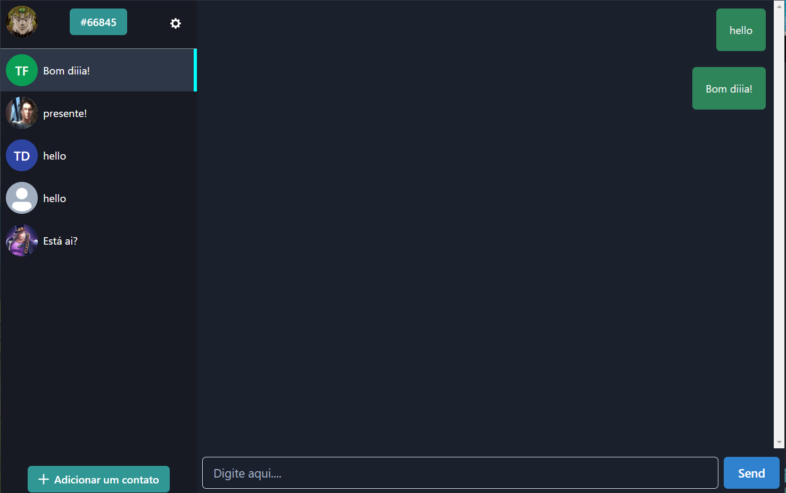

This is a [Next.js](https://nextjs.org/) project bootstrapped with [`create-next-app`](https://github.com/vercel/next.js/tree/canary/packages/create-next-app).

A basic and simples chat built with NextJS and Firebase

You can check it out [HERE!](https://simple-chat-talis-fb.vercel.app/)



## Languages and tools...
<p align="left">
    
    
    
    
    
    
</p>


## Getting Started

```bash
npm run dev
# or
yarn dev
```
Open [http://localhost:3000](http://localhost:3000) with your browser to see the result.
